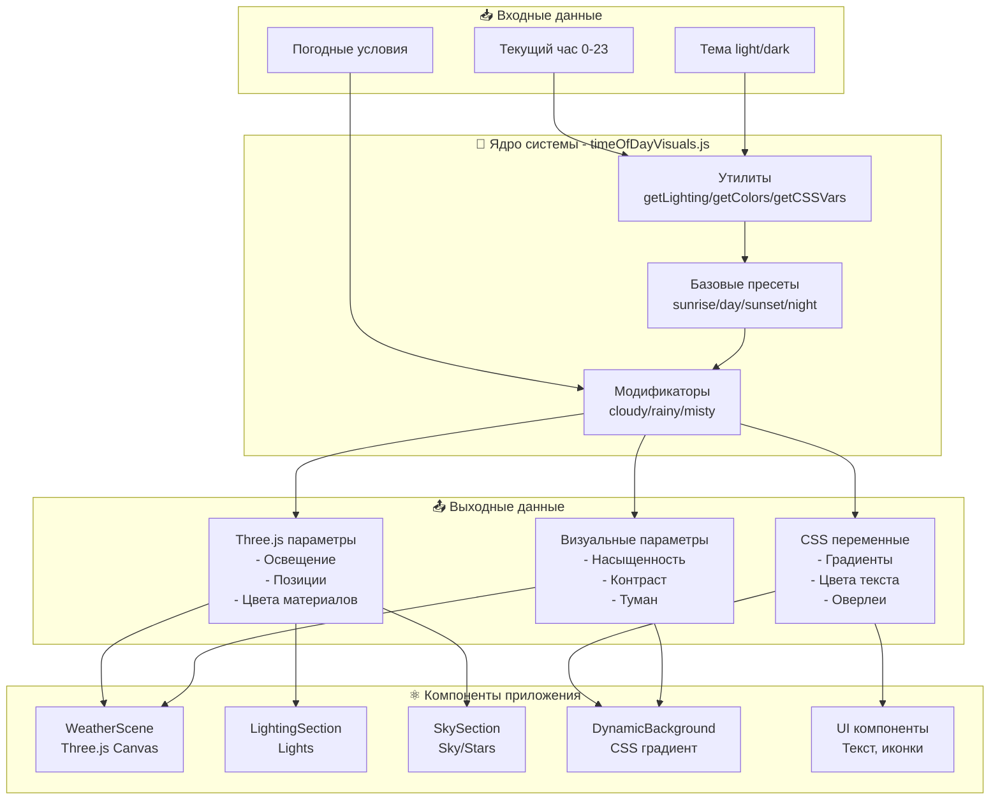
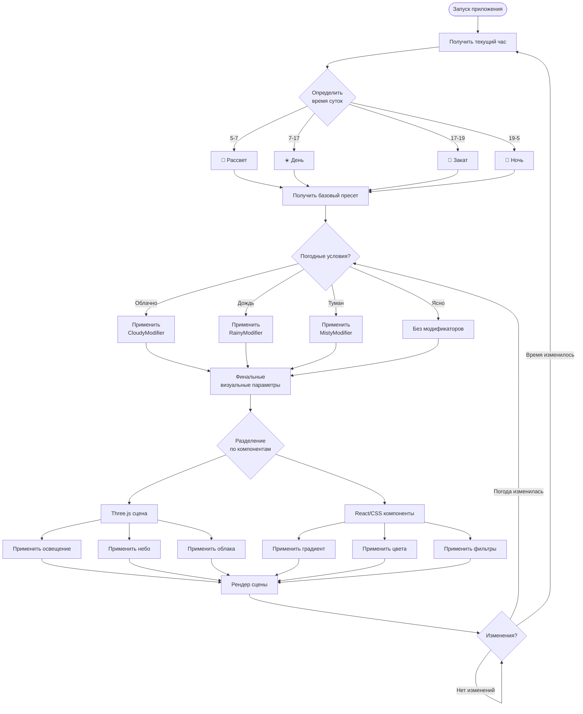
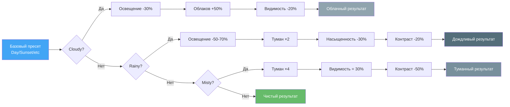
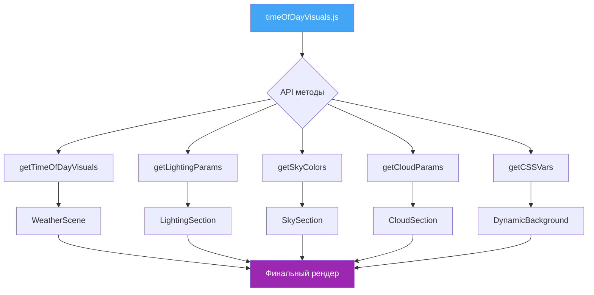

# 📊 Визуальная документация: Диаграммы и схемы

## 🏗️ Архитектура системы

### Общая архитектура

Система состоит из трех основных слоев:

1. **Входной слой** — Получение данных (час, погода, тема)
2. **Ядро системы** — Обработка и формирование параметров
3. **Выходной слой** — Применение к компонентам

```
📥 Входные данные → 🎨 Ядро системы → 📤 Параметры → ⚛️ Компоненты
```

### Детальная схема



---

## 🔄 Процесс применения стилей

### Пошаговый flow



---

## 🌈 Цветовые палитры

### Градиентные палитры по времени суток

#### 🌅 Рассвет (Sunrise)
```
┌─────────────────────────────────────────┐
│ #FF6B6B (Коралловый)                    │ ← Верх
├─────────────────────────────────────────┤
│                                         │
│ #FFB347 (Оранжево-персиковый)          │ ← Середина
│                                         │
├─────────────────────────────────────────┤
│ #FFE4B5 (Кремовый)                      │ ← Низ
└─────────────────────────────────────────┘
```

#### ☀️ День (Day)
```
┌─────────────────────────────────────────┐
│ #1E88E5 (Насыщенный синий)              │ ← Верх
├─────────────────────────────────────────┤
│                                         │
│ #42A5F5 (Средний голубой)               │ ← Середина
│                                         │
├─────────────────────────────────────────┤
│ #90CAF9 (Светло-голубой)                │ ← Низ
└─────────────────────────────────────────┘
```

#### 🌇 Закат (Sunset)
```
┌─────────────────────────────────────────┐
│ #FF6347 (Томатно-красный)               │ ← Верх
├─────────────────────────────────────────┤
│                                         │
│ #FF8C42 (Оранжево-золотой)              │ ← Середина
│                                         │
├─────────────────────────────────────────┤
│ #FFD700 (Золотой)                       │ ← Низ
└─────────────────────────────────────────┘
```

#### 🌙 Ночь (Night)
```
┌─────────────────────────────────────────┐
│ #0B1026 (Почти черный синий)            │ ← Верх
├─────────────────────────────────────────┤
│                                         │
│ #1A2238 (Темно-синий)                   │ ← Середина
│                                         │
├─────────────────────────────────────────┤
│ #2C3E50 (Синевато-серый)                │ ← Низ
└─────────────────────────────────────────┘
```

---

## 💡 Интенсивность освещения

### Сравнительная диаграмма

```
Яркость освещения по времени суток
┌────────────────────────────────────────────────────────┐
│ 1.0 │                  ████████████                    │ День
│     │                  ████████████                    │
│ 0.9 │                  ████████████                    │
│     │                                                  │
│ 0.8 │                                                  │
│     │      ██████                       ██████         │ Закат
│ 0.7 │      ██████                       ██████         │
│     │      ██████                       ██████         │
│ 0.6 │      ██████                       ██████         │ Рассвет
│     │                                                  │
│ 0.5 │                                                  │
│     │                                                  │
│ 0.4 │                                                  │
│     │                                                  │
│ 0.3 │                                                  │ Ночь
│     │  ███                                       ███   │
│ 0.2 │  ███                                       ███   │
│     │  ███                                       ███   │
│ 0.1 │  ███                                       ███   │
│     │                                                  │
│ 0.0 └──┬───┬───┬───┬───┬───┬───┬───┬───┬───┬───┬───┘
│      0   2   4   6   8  10  12  14  16  18  20  22   │
│                        Часы (0-23)                    │
└────────────────────────────────────────────────────────┘
```

---

## 📊 Модификаторы погоды

### Влияние модификаторов на параметры



---

## 🎯 Применение в компонентах

### Структура использования



---

## 📐 Параметры в числах

### Таймлайн времени суток

```
00:00 ────────────────────────────────────────────── 24:00
  │                                                    │
  ├─── 🌙 НОЧЬ ───┬─── 🌅 РАССВЕТ ───┬─── ☀️ ДЕНЬ ───┬─── 🌇 ЗАКАТ ───┬─── 🌙 НОЧЬ ───┤
  0              5                  7                17               19             24
  
Параметры:
  🌙 Ночь:    Освещение: 0.25 | Теплота: 20%  | Контраст: 50%
  🌅 Рассвет: Освещение: 0.50 | Теплота: 90%  | Контраст: 60%
  ☀️ День:    Освещение: 1.00 | Теплота: 50%  | Контраст: 100%
  🌇 Закат:   Освещение: 0.70 | Теплота: 100% | Контраст: 75%
```

---

## 🔍 Детальный разбор пресета

### Пример: Sunset (Закат)

```
┌─────────────────────────────────────────────────────────────┐
│ SUNSET PRESET                                               │
├─────────────────────────────────────────────────────────────┤
│ 🎨 ЦВЕТА                                                    │
│   Sky Top:     #FF6347 (Томатно-красный)                   │
│   Sky Middle:  #FF8C42 (Оранжево-золотой)                  │
│   Sky Bottom:  #FFD700 (Золотой)                            │
│   Clouds:      #FF7F50 (Коралловый)                         │
│   Fog:         #FFE4C4 (Бисквитный)                         │
├─────────────────────────────────────────────────────────────┤
│ 💡 ОСВЕЩЕНИЕ                                                │
│   Ambient:     0.45 intensity, #FFB347 color                │
│   Directional: 0.70 intensity, #FF6347 color                │
│   Position:    [8, 3, -2] (низко справа)                    │
│   Sun Glow:    1.3x                                         │
├─────────────────────────────────────────────────────────────┤
│ ☁️ ОБЛАКА & АТМОСФЕРА                                       │
│   Opacity:     75%                                          │
│   Density:     60%                                          │
│   Fog Density: 0.012                                        │
│   Visibility:  80%                                          │
├─────────────────────────────────────────────────────────────┤
│ 🎭 ГЛОБАЛЬНЫЕ ПАРАМЕТРЫ                                     │
│   Saturation:  95%                                          │
│   Contrast:    75%                                          │
│   Brightness:  80%                                          │
│   Warmth:      100% (максимально теплые тона)               │
└─────────────────────────────────────────────────────────────┘
```

---

## 📝 Легенда цветов

### Цветовая кодировка в диаграммах

| Цвет | Значение |
|------|----------|
| 🔴 Красный | Входные данные |
| 🔵 Синий | Ядро системы |
| 🟢 Зеленый | Выходные данные |
| 🟠 Оранжевый | Компоненты |
| 🟣 Фиолетовый | Рендер/Результат |
| ⚫ Серый | Модификаторы |

---

## 🚀 Быстрая навигация

- [← Назад к README](./TIME_OF_DAY_README.md)
- [Полная документация →](./TIME_OF_DAY_SYSTEM.md)
- [Справочник параметров →](./VISUAL_PARAMETERS_REFERENCE.md)
- [Примеры кода →](./examples/)

---

**Дата обновления**: 2026  
**Версия**: 1.0.0
